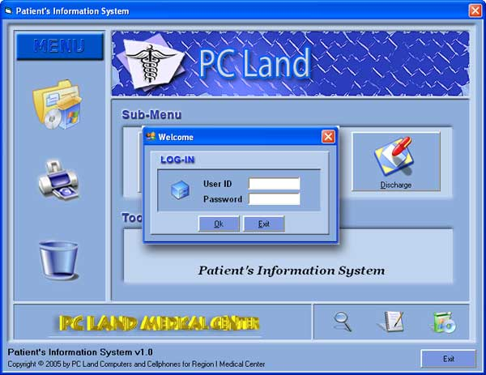



## Patient's Information System

### Description

Title: Patient's Information System v1.0

Description: The system is about organizing and maintaining the medical records of all patients. The program uses ADO and lots of user-defined functions to improve visual basic. The system is very intelligent that it can automatically determine if a record is for new or edit or delete. Therefore, the Add New, Edit, Cancel and Delete Buttons are reduced into 2 buttons only to minimize user's work and also maximize time efficiency. The following are some capabilities of the program:

1. It uses DAO technology to manipulate the databases.

2. Handle millions of records.

3. Uses very flexible search form.

4. Designed as professional looking software.

5. Use custom define procedures and functions to optimize your program execution.

6. Use of string and file manipulation to adopt different file locations.

7. Use API to improve functionalities.

8. USE THE PROGRAM TO KNOW MORE.

There are lot things to learn from this code so please try it and vote if you learned something from it. Thanks!
 
### More Info
 

             |
---                |---
**Submitted On**   |2006-05-10 17:03:54
**By**             |[Jeffrey Lim](https://github.com/Planet-Source-Code/PSCIndex/blob/master/ByAuthor/jeffrey-lim.md)
**Level**          |Beginner
**User Rating**    |4.8 (96 globes from 20 users)
**Compatibility**  |VB 6\.0
**Category**       |[Complete Applications](https://github.com/Planet-Source-Code/PSCIndex/blob/master/ByCategory/complete-applications__1-27.md)
**World**          |[Visual Basic](https://github.com/Planet-Source-Code/PSCIndex/blob/master/ByWorld/visual-basic.md)
**Archive File**   |[Patient's\_1993435122006\.zip](https://github.com/Planet-Source-Code/jeffrey-lim-patient-s-information-system__1-65303/archive/master.zip)

